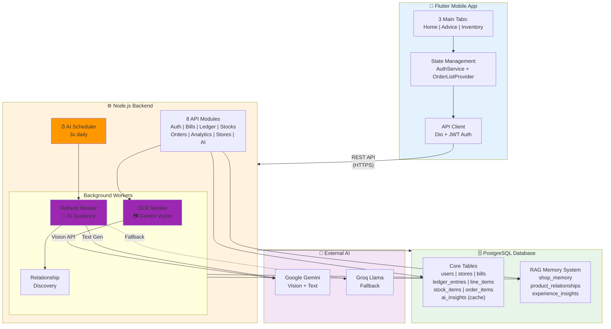
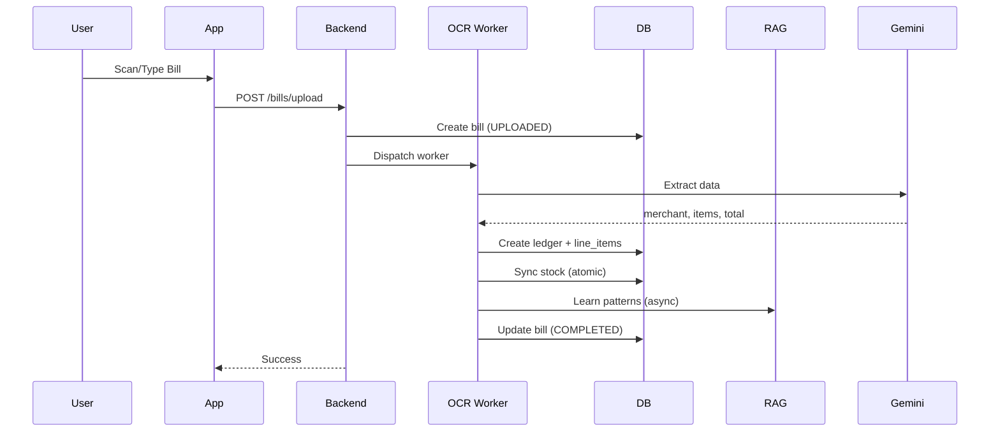
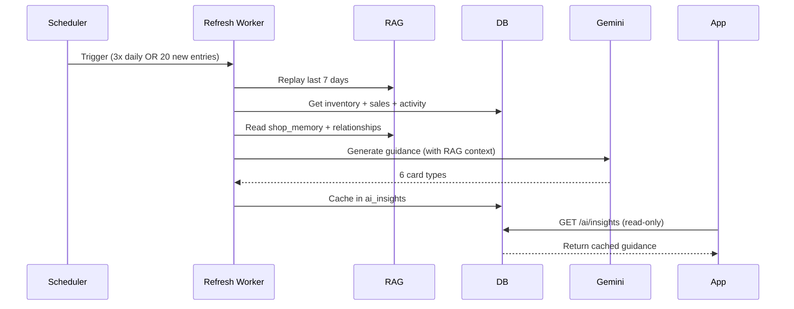
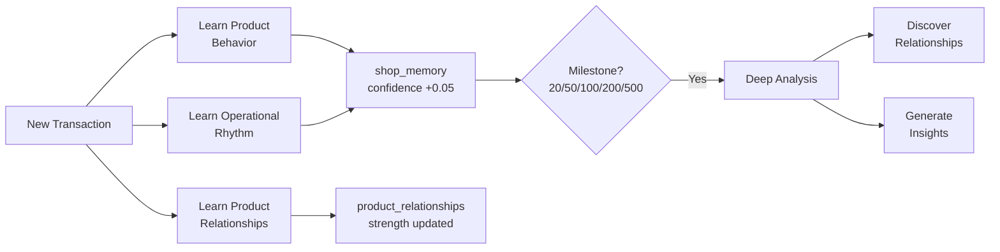

# AI Khata Architecture Diagram

## Simplified Complete System Architecture

## Core Data Flows

### 1️⃣ Bill Entry Flow

### 2️⃣ AI Guidance Flow

### 3️⃣ RAG Learning Flow

## Key Architecture Principles

| Principle | Description |
|-----------|-------------|
| **Read-Only AI** | App only reads from `ai_insights` cache via GET. Workers write asynchronously. |
| **JWT Auth** | Access token (short) + Refresh token (long). Silent refresh on 401. |
| **RAG Memory** | 3 tables learn shop patterns: behavior, relationships, insights. Confidence grows +0.05/observation. |
| **AI Triggers** | Runs 3x daily (06:00, 14:00, 22:00 UTC) OR every 20 new transactions. |
| **Stock Sync** | Atomic transactions. Purchase: `qty += n`. Sale: `qty = max(0, qty - n)`. |
| **State Management** | AuthService (top-level) → OrderListProvider (proxy). Optimistic updates. |

## Tech Stack Summary

| Layer | Technology |
|-------|------------|
| **Mobile** | Flutter + Material 3 + Provider |
| **Navigation** | go_router v2 (ShellRoute) |
| **HTTP** | Dio + JWT interceptor |
| **Backend** | Node.js + Express |
| **Database** | PostgreSQL |
| **AI** | Google Gemini (primary), Groq/Llama (fallback) |
| **Workers** | Node.js worker_threads |
| **Container** | Docker Compose |

## 6 AI Guidance Card Types

1. **stock_check** - Stock status (GOOD/WATCH/LOW)
2. **dead_stock** - Non-moving items + swap suggestions
3. **sales_expansion** - Cross-sell opportunities
4. **momentum_pattern** - Rising/opportunity products
5. **festival_preparation/experience** - Festival-specific guidance (≤10 days)
6. **shop_intelligence** - Memory maturity summary

---

*Simplified architecture diagram - March 2026*
