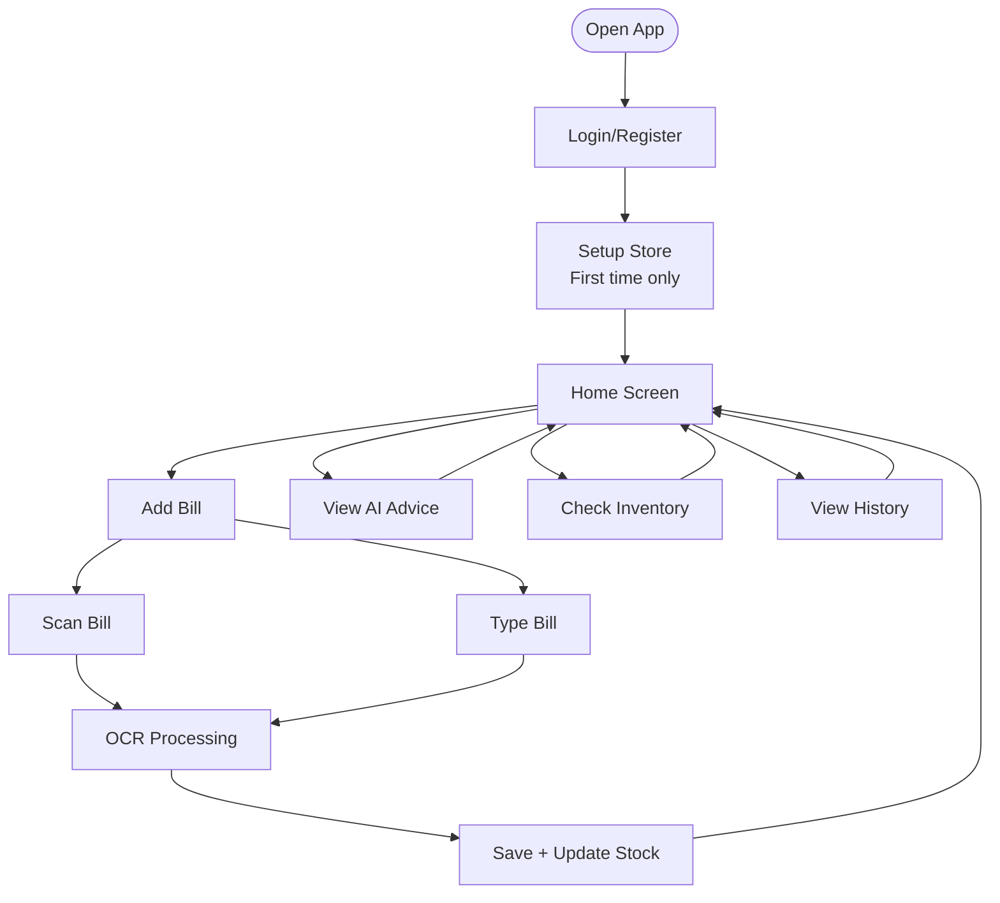

# AI Khata - User Flow

> **Simple user journey diagram**

---

## Complete User Flow

---

## Simple Flow Steps

1. **Login** → Enter credentials
2. **Setup** → Choose store type (first time)
3. **Home** → Main dashboard
4. **Add Bill** → Scan or type
5. **AI Advice** → View guidance
6. **Inventory** → Manage stock
7. **History** → View records

---

*Simple user flow - March 2026*
