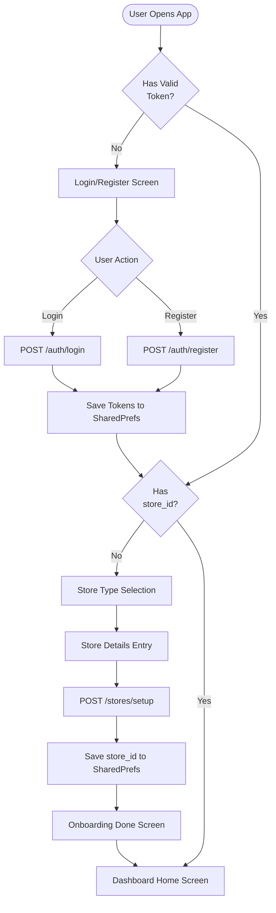
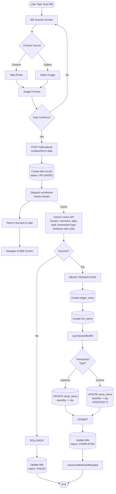
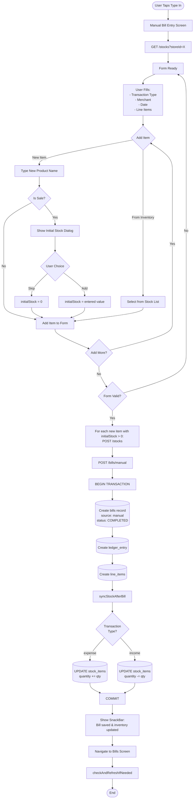
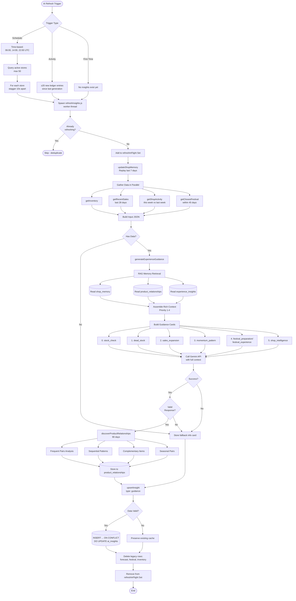
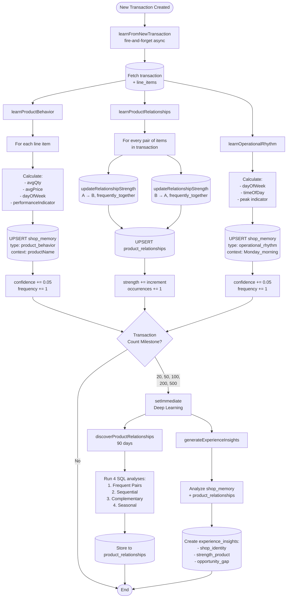
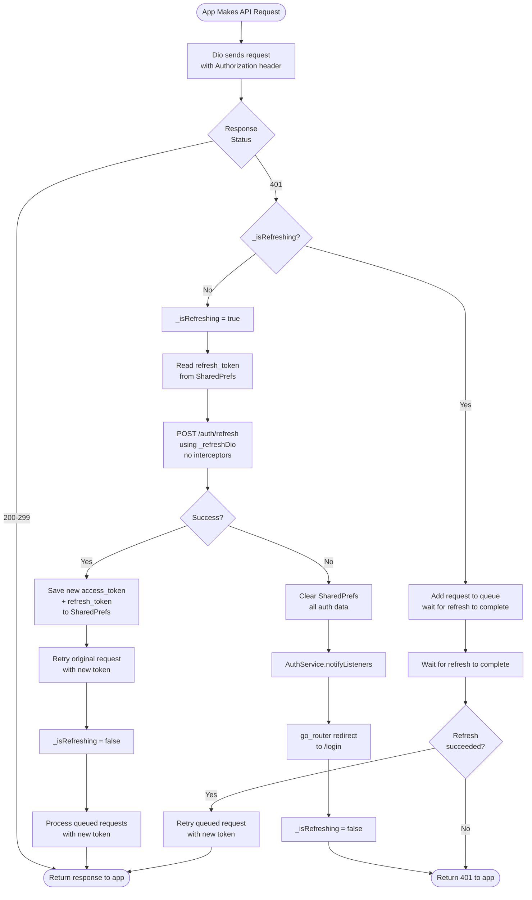
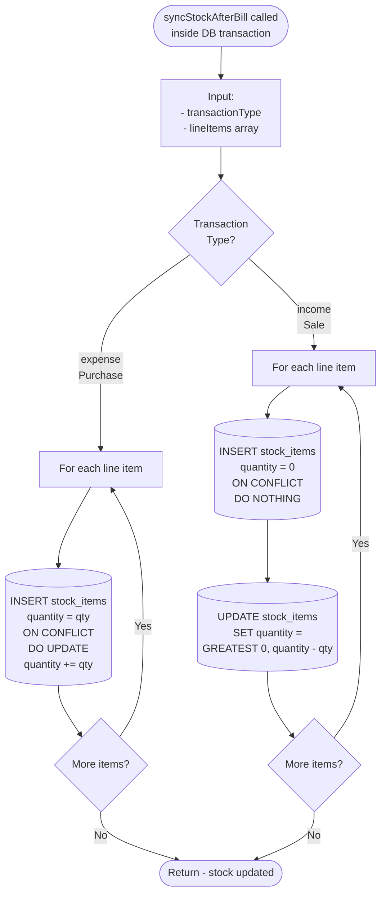
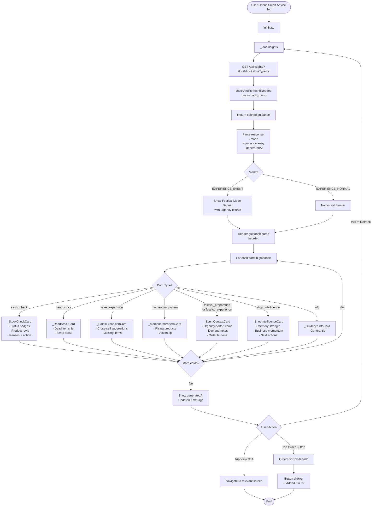
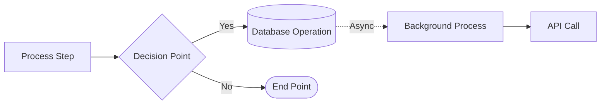

# AI Khata — Process Flow Diagrams

> Visual representation of key system flows extracted from ARCHITECTURE.md

---

## 1. User Authentication & Onboarding Flow



---

## 2. Bill Entry Flow — OCR Path



---

## 3. Bill Entry Flow — Manual Path



---

## 4. AI Insights Generation Flow



---

## 5. RAG Memory Learning Flow



---

## 6. App Data Loading Flow — Dashboard Home

```mermaid
flowchart TD
    Start([User Opens Dashboard]) --> InitState[initState]
    
    InitState --> LoadStats[_loadStats]
    InitState --> LoadAlerts[_loadUrgentAlerts]
    
    LoadStats --> SalesTrends[GET /analytics/sales-trends?days=30]
    LoadStats --> ProductRank[GET /analytics/product-rankings?days=30&limit=1]
    
    SalesTrends --> ParseStats[Parse:<br/>- Today total<br/>- Yesterday total<br/>- Monthly total]
    ProductRank --> ParseStats
    
    ParseStats --> UpdateStatsUI[Update Stats UI]
    
    LoadAlerts --> GetInsights[GET /ai/insights]
    GetInsights --> BackgroundCheck[checkAndRefreshIfNeeded<br/>runs in background]
    
    BackgroundCheck --> CheckStale{Data Stale?}
    CheckStale -->|≥20 new entries| TriggerRefresh[Trigger AI refresh<br/>non-blocking]
    CheckStale -->|No| ReturnCache
    
    TriggerRefresh --> ReturnCache[Return cached data]
    ReturnCache --> ParseAlerts[Parse guidance array]
    
    ParseAlerts --> ExtractHigh[Extract high urgency<br/>inventory alerts]
    ParseAlerts --> ExtractMedium[Extract medium urgency<br/>inventory alerts]
    ParseAlerts --> ExtractFestival[Extract festival[0]<br/>if exists]
    
    ExtractHigh --> BuildSuggestions[Build _suggestions list]
    ExtractMedium --> BuildSuggestions
    ExtractFestival --> BuildSuggestions
    
    BuildSuggestions --> UpdateAlertsUI[Update Action Center UI]
    
    UpdateStatsUI --> RenderHome[Render Home Screen:<br/>1. Urgent Banner<br/>2. Add Bill Card<br/>3. Performance Card<br/>4. Action Center<br/>5. Quick Health<br/>6. Medium Alerts<br/>7. Records Row]
    UpdateAlertsUI --> RenderHome
    
    RenderHome --> End([End])
```

---

## 7. Order List Management Flow

```mermaid
flowchart TD
    Start([User Action on Order List]) --> Action{Action Type}
    
    Action -->|Add Item| AddFlow[add method]
    Action -->|Remove Item| RemoveFlow[remove method]
    Action -->|Update Qty| UpdateQtyFlow[updateQty method]
    Action -->|Update Unit| UpdateUnitFlow[updateUnit method]
    Action -->|Mark All Ordered| MarkOrderedFlow[markAllOrdered method]
    Action -->|Ordered + Update Stock| UpdateStockFlow[Ordered — Update Stock button]
    
    AddFlow --> CheckExists{Item exists<br/>in list?}
    CheckExists -->|Yes| NoOp([No-op - already in list])
    CheckExists -->|No| AddLocal[Add to local list<br/>optimistic update]
    AddLocal --> AddAPI[POST /order-items]
    AddAPI --> AddSuccess{Success?}
    AddSuccess -->|Yes| ReplaceLocal[Replace local item<br/>with server version<br/>has UUID now]
    AddSuccess -->|No| RevertAdd[Revert local add]
    ReplaceLocal --> NotifyAdd[notifyListeners]
    RevertAdd --> NotifyAdd
    
    RemoveFlow --> RemoveLocal[Remove from local list<br/>optimistic update]
    RemoveLocal --> RemoveAPI[DELETE /order-items/:id]
    RemoveAPI --> RemoveSuccess{Success?}
    RemoveSuccess -->|Yes| NotifyRemove[notifyListeners]
    RemoveSuccess -->|No| RevertRemove[Revert local remove]
    RevertRemove --> NotifyRemove
    
    UpdateQtyFlow --> CheckQty{qty <= 0?}
    CheckQty -->|Yes| RemoveFlow
    CheckQty -->|No| UpdateQtyLocal[Update qty locally]
    UpdateQtyLocal --> UpdateQtyAPI[PATCH /order-items/:id {qty}]
    UpdateQtyAPI --> QtySuccess{Success?}
    QtySuccess -->|Yes| NotifyQty[notifyListeners]
    QtySuccess -->|No| RevertQty[Revert local qty]
    RevertQty --> NotifyQty
    
    UpdateUnitFlow --> UpdateUnitLocal[Update unit locally]
    UpdateUnitLocal --> UpdateUnitAPI[PATCH /order-items/:id {unit}]
    UpdateUnitAPI --> UnitSuccess{Success?}
    UnitSuccess -->|Yes| NotifyUnit[notifyListeners]
    UnitSuccess -->|No| RevertUnit[Revert local unit]
    RevertUnit --> NotifyUnit
    
    MarkOrderedFlow --> ClearLocal[Clear local list]
    ClearLocal --> ClearAPI[DELETE /order-items?storeId=X]
    ClearAPI --> ClearSuccess{Success?}
    ClearSuccess -->|Yes| NotifyClear[notifyListeners]
    ClearSuccess -->|No| RevertClear[Revert local clear]
    RevertClear --> NotifyClear
    
    UpdateStockFlow --> LoopItems[For each order item]
    LoopItems --> FindStock[Find matching stock item<br/>by name case-insensitive]
    FindStock --> StockExists{Stock<br/>exists?}
    StockExists -->|Yes| UpdateStock[PUT /stocks/:id<br/>quantity = current + orderQty]
    StockExists -->|No| CreateStock[POST /stocks<br/>quantity = orderQty]
    UpdateStock --> NextItem{More items?}
    CreateStock --> NextItem
    NextItem -->|Yes| LoopItems
    NextItem -->|No| ClearAfterUpdate[markAllOrdered]
    ClearAfterUpdate --> ShowSnackBar[Show SnackBar:<br/>Stock updated! X items added]
    ShowSnackBar --> EndFlow([End])
    
    NotifyAdd --> EndFlow
    NotifyRemove --> EndFlow
    NotifyQty --> EndFlow
    NotifyUnit --> EndFlow
    NotifyClear --> EndFlow
    NoOp --> EndFlow
```

---

## 8. JWT Token Refresh Flow



---

## 9. Stock Sync After Bill Flow



---

## 10. Smart Advice Screen Data Flow



---

## Legend



- **Rectangle**: Process step or action
- **Diamond**: Decision point or conditional
- **Cylinder**: Database operation
- **Rounded rectangle**: Start/End point
- **Dashed arrow**: Asynchronous or background operation
- **Solid arrow**: Synchronous flow

---

## Notes

1. All flows are extracted from the ARCHITECTURE.md document
2. Error handling paths are included where critical
3. Background/async operations are marked with dashed lines
4. Database transactions are shown with cylinder shapes
5. User interactions are marked with rounded rectangles

These diagrams can be rendered using any Mermaid-compatible viewer (GitHub, VS Code with Mermaid extension, mermaid.live, etc.)
