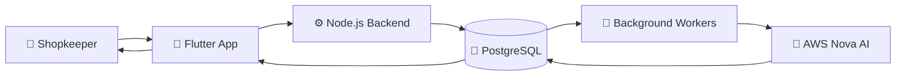
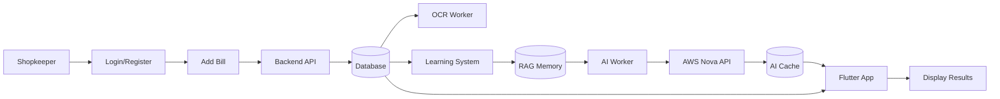

# AI Khata — System Flow

```mermaid
flowchart LR
    A[👤 Shopkeeper] --> B[📱 Flutter App]
    B --> C[⚙️ Node.js Backend]
    C --> D[(💾 PostgreSQL)]
    D --> E[🔄 Background Workers]
    E --> F[🤖 AWS Nova AI]
    F --> D
    D --> B
    B --> A
```

---

## Detailed Flow

```mermaid
flowchart LR
    User[Shopkeeper] --> Login[Login/Register]
    Login --> AddBill[Add Bill]
    AddBill --> Backend[Backend API]
    Backend --> Database[(Database)]
    Database --> OCR[OCR Worker]
    Database --> Learning[Learning System]
    Learning --> Memory[(RAG Memory)]
    Memory --> AIWorker[AI Worker]
    AIWorker --> Nova[AWS Nova API]
    Nova --> Cache[(AI Cache)]
    Cache --> App[Flutter App]
    Database --> App
    App --> Display[Display Results]
```
